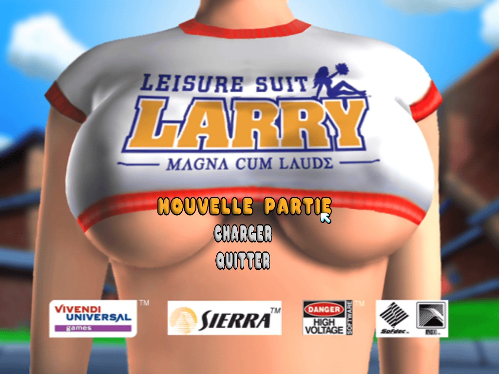
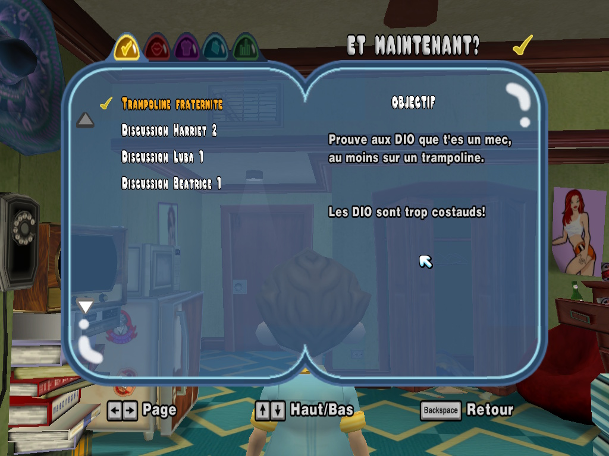
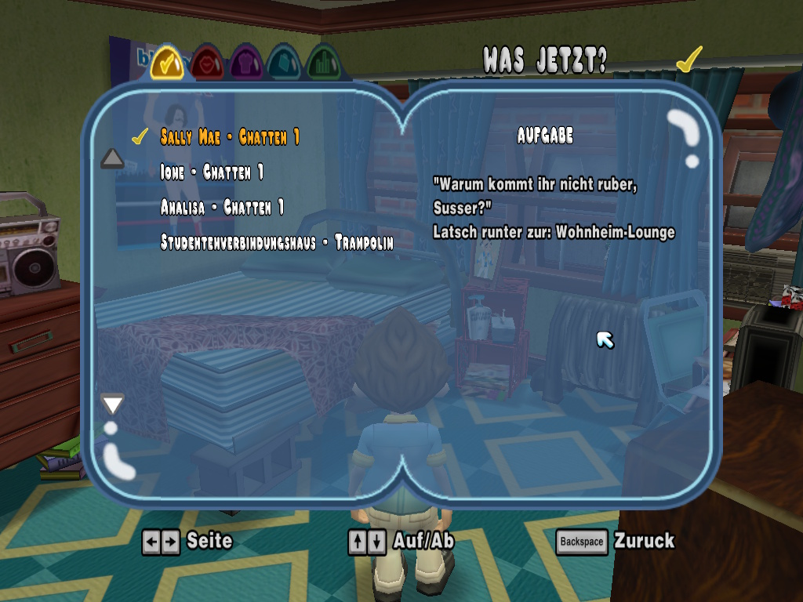
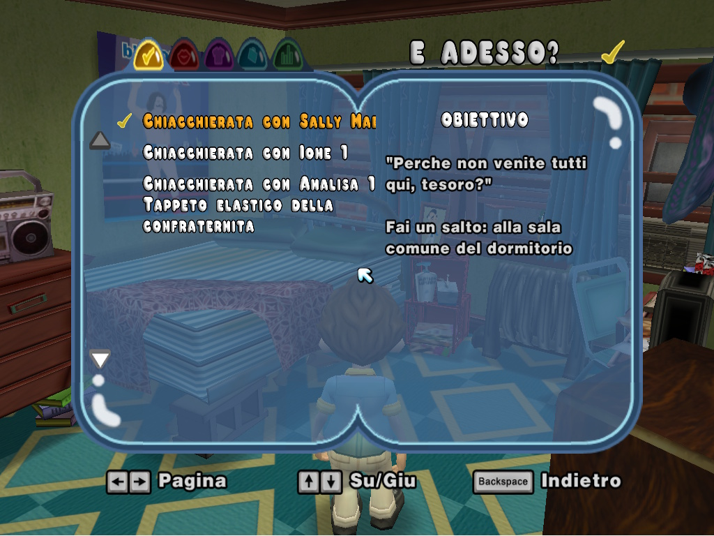

# Leisure Suit Larry: Magna Cum Laude --- Multi Language PC

<p align="center">
  
  
  
  
  
</p>


Outil de localisation et de reconstruction pour **Leisure Suit Larry:
Magna Cum Laude** permettant d'exploiter les ressources des versions
**PS2** afin de créer une version **PC localisée**.

Développé par **Gallyberseker**.

> ⚠️ Ce projet ne distribue pas le jeu ni ses fichiers propriétaires.\
> Vous devez posséder légalement les versions nécessaires de *Leisure
> Suit Larry: Magna Cum Laude*.

------------------------------------------------------------------------

## 🎯 Objectif du projet

Le but est de reconstruire automatiquement une version PC localisée du
jeu en utilisant les données disponibles dans les différentes versions
PS2.

Langues actuellement prises en charge par l'architecture :

-   EN Anglais
-   🇫🇷 Français
-   🇩🇪 Allemand
-   🇪🇸 Espagnol
-   🇮🇹 Italien
-   🌍 Autres langues / extensions prévues

Le projet ne se limite pas à remplacer quelques textes : il analyse et
adapte les différentes ressources utilisées par le jeu.

------------------------------------------------------------------------

## ✨ Fonctionnalités

### 📝 Textes et interfaces

-   Analyse des fichiers du jeu PC et PS2
-   Localisation des textes
-   Traitement des fichiers JAM
-   Adaptation des menus
-   Correction de textes dépassant des zones d'affichage
-   Modification de paramètres de géométrie
-   Gestion spécifique de certaines interfaces comme le Livre noir
-   Gestion séparée des langues

### 🔊 Audio

-   Analyse des ressources audio PC et PS2
-   Gestion des banques AFS
-   Gestion des fichiers ADX / AHX
-   Recherche des correspondances audio
-   Reconstruction et injection des voix
-   Restauration des voix présentes sur PS2 mais absentes de la version
    PC
-   Traitement des références AOS / AOT / AOD
-   Conservation des contraintes propres au moteur PC

### 🎬 Cinématiques

-   Analyse des fichiers SFD
-   Localisation de l'audio des cinématiques
-   Conservation de la structure vidéo PC
-   Injection audio dans les zones prévues par les SFD
-   Contrôle de la taille des données injectées
-   Gestion des cinématiques nécessitant de conserver leur version
    originale

### 🖼️ Images

-   Extraction des ressources graphiques
-   Analyse des images contenues dans les fichiers du jeu
-   Gestion BMP / DDS
-   Préparation des ressources pour modification et réinjection

### 🔍 Diagnostic

Le programme possède plusieurs outils destinés au reverse engineering et
au diagnostic :

-   comparaison PC / PS2
-   analyse des fichiers JAM
-   analyse audio
-   analyse AFS
-   recherche de références
-   diagnostic des textes
-   diagnostic des ressources
-   génération de rapports
-   journalisation des opérations

------------------------------------------------------------------------

## 🧩 Architecture modulaire

Le projet a été entièrement restructuré afin de séparer les différentes
responsabilités.

``` text
LSL_MCL_ACX.py
LSL_MCL_ANALISES.py
LSL_MCL_AUDIOS.py
LSL_MCL_BACKUP.py
LSL_MCL_BASE64.py
LSL_MCL_COMPUTER.py
LSL_MCL_CONSOLE_LOG.py
LSL_MCL_CONSOLE_PS2.py
LSL_MCL_DEPENDANCE.py
LSL_MCL_DIAGNOSTICS.py
LSL_MCL_EXTRACTIONS.py
LSL_MCL_GEOMETRIES.py
LSL_MCL_IMAGES.py
LSL_MCL_INJECTIONS.py
LSL_MCL_JAMS.py
LSL_MCL_LANGUAGES.py
LSL_MCL_LANGUAGES_DE.py
LSL_MCL_LANGUAGES_EN.py
LSL_MCL_LANGUAGES_ES.py
LSL_MCL_LANGUAGES_FR.py
LSL_MCL_LANGUAGES_IT.py
LSL_MCL_LANGUAGES_OTHERS.py
LSL_MCL_Lecteur_ISO9660.py
LSL_MCL_MAIN.py
LSL_MCL_MENU.py
LSL_MCL_OUTILS.py
LSL_MCL_REFERENCES_AOS.py
LSL_MCL_REFERENCES_TECHNICS.py
LSL_MCL_ROUTAGE.py
LSL_MCL_TEXTES.py
LSL_MCL_VARIABLES.py
LSL_MCL_VIDEOS.py
```

Le point d'entrée principal reste :

``` text
Larry_MCL_Language_Multi_PS2_To_PC.py
```

Cette organisation facilite la maintenance et permet de travailler
séparément sur l'audio, les vidéos, les textes, les images ou les outils
de diagnostic.

------------------------------------------------------------------------

## ⚙️ Configuration --- `LSL_MCL_VARIABLES.py`

Le fichier :

``` text
LSL_MCL_VARIABLES.py
```

centralise une partie importante de la configuration du moteur.

Il contient notamment plusieurs **booléens (`True` / `False`)**
permettant d'activer ou de désactiver :

-   les différentes catégories du menu ;
-   les outils de diagnostic ;
-   les fonctions d'analyse ;
-   les fonctions de reverse engineering ;
-   certaines extractions ;
-   certaines options expérimentales ;
-   différentes fonctions utilisées pendant le développement.

### 🔘 Fonctionnement des booléens

Le principe est simple :

``` python
True   # Option activée
False  # Option désactivée
```

Cela permet de conserver les fonctions dans le moteur sans
obligatoirement les rendre accessibles depuis le menu principal.

### 🔒 Configuration du build par défaut

**Par défaut, le build est configuré avec les menus et outils optionnels
désactivés.**

Cette configuration correspond à une utilisation normale du moteur de
traduction et évite d'afficher les nombreuses fonctions internes
utilisées pendant le développement et le reverse engineering.

Les développeurs ou utilisateurs avancés peuvent modifier les booléens
dans :

``` text
LSL_MCL_VARIABLES.py
```

afin de réactiver les menus et fonctions dont ils ont besoin.

### ⚠️ Modules et options à garder actifs

Certaines parties nécessaires au fonctionnement du moteur doivent
cependant rester actives, notamment :

``` text
VIDEO
IMAGE
AUDIO
REFERENCES_TECHNICS
REFERENCES_AOS
```

Elles correspondent principalement aux modules :

``` text
LSL_MCL_VIDEOS.py
LSL_MCL_IMAGES.py
LSL_MCL_AUDIOS.py
LSL_MCL_REFERENCES_TECHNICS.py
LSL_MCL_REFERENCES_AOS.py
```

> ⚠️ Il est déconseillé de modifier les booléens sans connaître leur
> rôle. Certaines options peuvent être utilisées par d'autres parties du
> moteur même lorsqu'elles ne correspondent pas directement à une entrée
> visible du menu.

------------------------------------------------------------------------

## 🔄 Principe de construction

Le programme travaille sur des copies des données afin d'éviter de
modifier directement les fichiers sources pendant la construction.

Principe général :

``` text
Version PC originale
        │
        ▼
PC_VERSION_BACKUP
        │
        ▼
PC_VERSION_EDIT_TEMPS
        │
        ├── Textes
        ├── JAM
        ├── Géométrie
        ├── Images
        ├── Audio
        ├── AFS
        └── Cinématiques SFD
        │
        ▼
PC_VERSION_EDIT_FINI
        │
        ▼
Installation dans le dossier du jeu
```

`PC_VERSION_EDIT_FINI` représente ainsi la version reconstruite prête à
être installée.

------------------------------------------------------------------------

## 📂 Versions nécessaires

Le moteur de traduction nécessite les ressources des **versions
originales PC et PS2** de *Leisure Suit Larry: Magna Cum Laude*.

Le programme travaille notamment à partir de :

``` text
PC_VERSION
PS2_VERSION
```

Une sauvegarde de la version PC peut également être utilisée :

``` text
PC_VERSION_BACKUP
```

Le programme génère ensuite ses dossiers temporaires et sa version
finale.

------------------------------------------------------------------------

## 🛠️ Outils externes

Certaines opérations peuvent utiliser des outils spécialisés présents
dans le projet ou configurés par l'utilisateur, notamment :

``` text
ffmpeg
ffprobe
AFSPacker
sfd-muxer
cricodecs
```

Ils servent notamment à l'analyse ou au traitement des formats
multimédias et CRI utilisés par le jeu.

------------------------------------------------------------------------

## 🚀 Lancement

Depuis le dossier du projet :

``` powershell
python Larry_MCL_Language_Multi_PS2_To_PC.py
```

Le programme affiche ensuite son menu principal et les différentes
opérations disponibles selon la configuration définie dans
`LSL_MCL_VARIABLES.py`.

------------------------------------------------------------------------

## 💾 Sauvegardes

Avant toute modification importante, conservez toujours une copie propre
de votre installation originale.

Le projet dispose également de fonctions de sauvegarde et de
restauration permettant de revenir à une version précédente des données
du jeu.

------------------------------------------------------------------------

## ⚠️ Projet expérimental

Ce projet repose en partie sur du **reverse engineering des formats et
structures de données du jeu**.

Certaines ressources diffèrent entre les versions PC et PS2. Une simple
copie de fichiers n'est donc pas toujours possible : certains éléments
doivent être analysés, reconstruits ou adaptés afin de rester
compatibles avec le moteur PC.

Le projet continue d'évoluer au fur et à mesure de la compréhension des
formats internes du jeu.

------------------------------------------------------------------------

## 📌 État actuel

Parmi les travaux réalisés :

-   refonte du projet en modules séparés
-   localisation des textes et menus
-   traitement des fichiers JAM
-   adaptation de plusieurs éléments d'interface
-   gestion des ressources audio ADX / AHX
-   analyse et reconstruction des banques AFS
-   restauration de voix absentes de la version PC
-   traitement des cinématiques SFD
-   correction et adaptation de l'audio des vidéos
-   outils de comparaison PC / PS2
-   diagnostics automatisés
-   extraction et traitement des ressources graphiques

------------------------------------------------------------------------

## 👨‍💻 Auteur

**Gallyberseker**

Projet développé dans le cadre de la localisation et du reverse
engineering de :

**Leisure Suit Larry: Magna Cum Laude**

------------------------------------------------------------------------

## 📋 TODO List

### 🎨 Géométrie et dimensions des menus

-   [ ] Corriger et rééquilibrer les dimensions des différents éléments
    des menus.
-   [ ] Restaurer progressivement des proportions visuelles plus proches
    de la version PS2.
-   [ ] Ajuster les rectangles, positions, espacements et tailles des
    différents éléments d'interface.
-   [ ] Vérifier chaque modification directement en jeu afin d'éviter
    les chevauchements et débordements de texte.
-   [ ] Finaliser les réglages du Livre noir et des autres interfaces
    concernées.

> **Note :** les dimensions de plusieurs éléments des menus ont
> volontairement été réduites pendant le développement afin de vérifier
> le bon fonctionnement du système de modification des géométries.
>
> Ces tests ont permis de confirmer que le moteur prend correctement en
> compte les changements de dimensions et de positions.
>
> Une future mise à jour aura pour objectif de réajuster ces valeurs
> afin d'obtenir un rendu visuel plus équilibré et plus proche des
> proportions de la version PS2.

------------------------------------------------------------------------

## ⚖️ Avertissement

*Leisure Suit Larry*, *Leisure Suit Larry: Magna Cum Laude* ainsi que
leurs ressources, marques, personnages, sons, vidéos et autres contenus
appartiennent à leurs propriétaires respectifs.

Ce projet est un outil indépendant destiné à travailler avec les
fichiers appartenant à l'utilisateur.

**Les versions originales PC et PS2 du jeu sont nécessaires au
fonctionnement du moteur de traduction.**

Ce projet ne fournit pas ces versions et ne contient pas les fichiers
originaux du jeu nécessaires à son fonctionnement.

L'utilisateur doit posséder légalement les versions **PC et PS2** de
*Leisure Suit Larry: Magna Cum Laude* utilisées par le programme.

Aucun fichier original du jeu ne doit être redistribué avec ce projet
sans l'autorisation des ayants droit concernés.

### ⚠️ Responsabilité

Ce projet est fourni **en l'état**.

Il est actuellement en cours de développement et reste notamment en attente :

- de mises à jour concernant la géométrie et les dimensions des menus ;
- d'ajustements visuels afin de se rapprocher davantage du rendu de la version PS2 ;
- de tests plus larges sur les différentes langues, ressources et situations de jeu.

Certaines imperfections visuelles ou incompatibilités peuvent donc encore être présentes dans la version actuelle.

L'auteur, **Gallyberseker**, ne pourra être tenu responsable d'une
mauvaise utilisation du moteur de traduction, d'une modification
incorrecte des fichiers du jeu, d'une perte de données ou de tout autre
problème résultant de son utilisation.

Il est fortement recommandé de conserver une **sauvegarde complète du
dossier `Data` original de Leisure Suit Larry: Magna Cum Laude** avant
toute traduction, modification, injection ou reconstruction.

``` text
Leisure Suit Larry - Magna Cum Laude\
└── Data\
```

Ne travaillez jamais sans sauvegarde de vos fichiers originaux.
